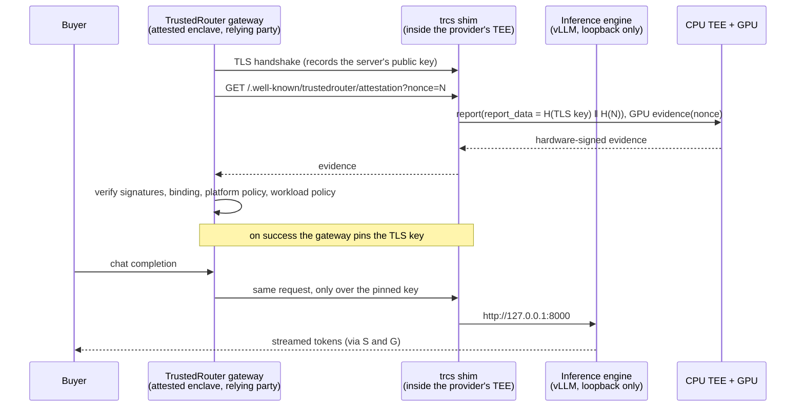

# Architecture

## The short version

Two containers and one protocol.

- The **inference engine** is an unmodified OpenAI-compatible server (vLLM by
  default). It listens on loopback only, with request logging and usage
  telemetry off.
- **`trcs shim`** is the only thing reachable from outside. It terminates TLS
  with a key generated inside the TEE, serves hardware evidence bound to that
  key, and proxies `/v1/*` to the engine without buffering streams and without
  logging bodies, headers or query strings. It is a single static Go binary
  with no third-party dependencies, so it can be read in one sitting.
- The **relying party** verifies the evidence, applies policy, and pins the key.
  That is TrustedRouter's gateway, which already does exactly this for one
  confidential provider today (dual-source attestation fetch, full signature
  chain, TLS key pinning, fail closed). The gateway-side verifier for this
  protocol is not part of this repository.

## Three ways to run it, one protocol

| Path | Trust boundary | Evidence source | GPUs per workload | Where the hard part lives |
|---|---|---|---|---|
| **Kubernetes confidential containers** | The pod's VM (Kata + SEV-SNP or TDX) | `coco-aa`: the Confidential Containers attestation agent inside the guest | One, or all GPUs of the node on platforms NVIDIA lists for multi-GPU | NVIDIA's Confidential Containers reference architecture (GA since April 2026) and the Kata and GPU Operator Helm charts. This repository adds the workload chart on top. |
| **dstack confidential VM** | The whole VM | `dstack`: the dstack guest agent socket | All GPUs passed to the VM | [dstack](https://github.com/Dstack-TEE/dstack) (Apache-2.0, a Confidential Computing Consortium project) builds and measures the VM. This repository supplies the compose application. Works on bare-metal TDX and on Google Cloud TDX VMs. |
| **Your own measured VM image** | The whole VM | `configfs-tsm`: the Linux TSM report interface | Whatever you pass through | For teams that already build measured images. You own the reference measurements. |
| **standard** | None | `none` | Any | Nothing to verify. The operator can read all traffic. |

The Helm chart and the Kustomize tree cover the first path and `standard` mode.
The other two paths run the same two containers outside Kubernetes.

## What makes evidence mean something: measured workload identity

A hardware report proves "some code in a genuine TEE asked for this report". It
becomes useful only when the verifier can tell *which* code.

- **Confidential containers.** The launch measurement covers the guest firmware,
  kernel, initrd and kernel command line. The pod definition is bound through
  *init-data*: a document containing the Kata agent policy, whose digest the
  host must place in the report's `HOST_DATA` (SEV-SNP) or `MRCONFIGID` (TDX)
  field. The policy pins container image digests, commands, arguments and
  environment, and by default denies `exec` and log streaming. The verifier
  accepts only init-data digests it recognises.
- **dstack.** The application's compose file is measured into the runtime event
  log, and the verifier checks the compose hash.
- **Your own image.** A measured direct boot with a verity-protected root
  filesystem. A stock cloud OS image does **not** qualify: the report would
  attest the platform but say nothing about what is running.

### Evidence factories

Inside a confidential-containers guest, any container can ask the attestation
agent for evidence over arbitrary data. If two different workloads produced
indistinguishable reports, a malicious host could run a second, modified pod,
have it mint evidence that binds the *host's* TLS key, and present that as the
real workload. The Confidential Containers project calls this an
[evidence factory](https://confidentialcontainers.org/docs/features/get-attestation/).
The defence is the previous section: the init-data digest differs for a
different pod definition, and verification step 9 of the protocol rejects it.
A verifier that skips workload policy is not verifying anything.

### What GPU evidence does and does not prove

An NVIDIA attestation report proves a genuine GPU in confidential-computing
mode signed the verifier's nonce. It does **not**, by itself, prove that GPU is
attached to *this* VM: the report binds the device and the nonce, not the
guest, and could be relayed from another machine. What closes the gap today is
the measured guest software, which establishes the encrypted session with the
GPU and refuses to run without it. Hardware device binding (TDISP / TEE-IO)
will close it properly when it is available end to end.

## Why TLS terminates in the pod

The chart ships no `Ingress`. Anything that terminates TLS in front of the
workload holds plaintext outside the TEE, and the relying party would be
pinning the proxy's key instead of the workload's. Expose the Service with a
layer-4 load balancer or a node port.

## Why acceptance policy is not in this repository

See `threat-model.md`. Attacks on TEEs are published several times a year, so
the list of acceptable CPUs, firmware versions and GPU VBIOS versions has to be
changeable in one place, by the party that carries the risk, without waiting
for providers to redeploy.

## Relationship to other TrustedRouter repositories

| Repository | Role |
|---|---|
| [trustedrouter-provider-check](https://github.com/Lore-Hex/trustedrouter-provider-check) | Checks that an endpoint satisfies the gateway's API contract. Run it against the endpoint this stack gives you. |
| [quill-cloud-proxy](https://github.com/Lore-Hex/quill-cloud-proxy) | The attested gateway. Home of the relying-party verifier. |
| [reverse-harness](https://github.com/Lore-Hex/reverse-harness) | The lightweight way to expose a local model. It tunnels through a TLS-terminating service, so it can only ever be `standard`. |
